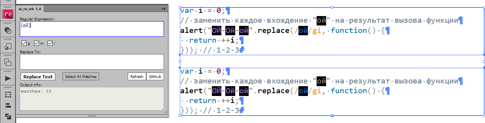
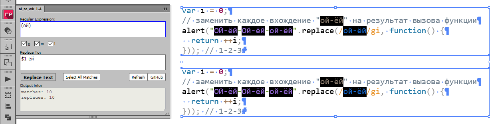
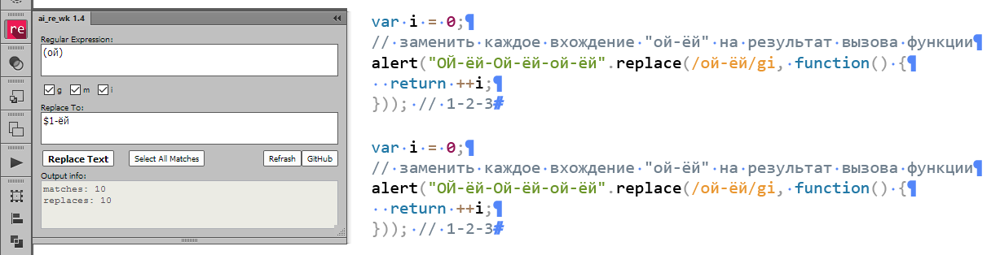

#ai_re_1.4: Search and Replace by `Regular Expression`
## Saves the `original formatting` of the text
###The html/css/js extension panel for Adobe `Illustrator CC+`

####Use the `Select All Matches` button for preview all matches:

####Use `Replace` button for replace all matches:

####Formatting text remains the same:

####What has been changed in this version:
* Fix the bugs

####Using:
1. Select text frame[s] using the Selection Tool, Direct Selection Tool or Group Selection Tool.
2. In the `Regular Expression:` field input a regular expression pattern.
3. On the `Replace To:` field input the replacement string.
4. Set the flags `g`, `m`, `i`.
5. Push the `Select All Matches` button for preview.
6. Push the `Replace` button for replace.

####Other options:
* Can use the references to captured groups like `$1`, `$2` etc. in the both input fields.
* Can use the special chearacters like `\r`, `\t` etc. in both input fields.
* `Refresh` button is used to clear the input fields and the console.
* The result of the work is displayed in the `Output info` field.
* `GitHub` button opens this public repository in the default internet browser.
